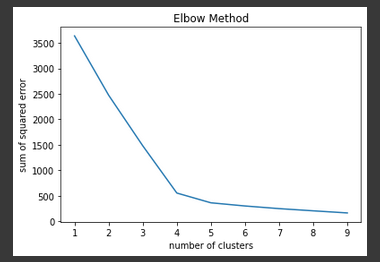
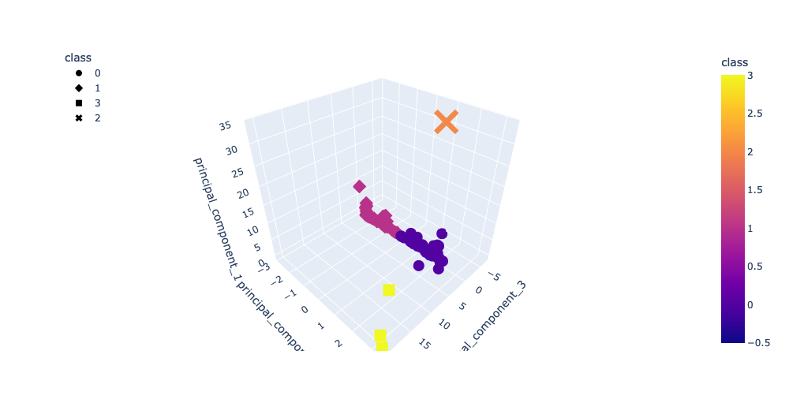
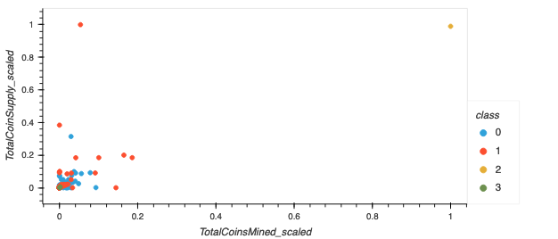

# cryptocurrencies

## Overview

Using [Principal Component Analysis (PCA)](https://en.wikipedia.org/wiki/Principal_component_analysis) and [k-means clustering](https://en.wikipedia.org/wiki/K-means_clustering), create an analysis for our clients - Accountability Accounting - who are preparing to enter the cryptocurrency market. In this analysis, cryptocurrencies will be grouped with the following in mind: our groups - or clusters - may be valuable for creating portfolios of particular cryptocurrencies. 

## Summary

### Elbow method for determining the appropriate number of clusters for our k-means model

Using the [elbow method](https://www.geeksforgeeks.org/elbow-method-for-optimal-value-of-k-in-kmeans/), we determined that four was an optimal number of clusters. See the chart below for results. 

<br />



<br />
<br />

### A 3-D representation of our PCA components clustered
<br />



<br />
<br />

### Total coin supply and mined data scaled clustered
<br />



<br />
<br />

## Usage Notes

Note: due to difficulties running this locally using Jupyter Lab, [crypto_clustering.ipynb](crypto_clustering.ipynb) was run in a Google Colab notebook. If running this code in Jupyter Lab / Notebook, you may need to comment out or remove the following: 

This import and environment variable setting: 
``` 
import holoviews as hv
%env HV_DOC_HTML=true
```
and this line in any cell that renders an `hvplot` visualization.

```
hv.extension('bokeh')
```